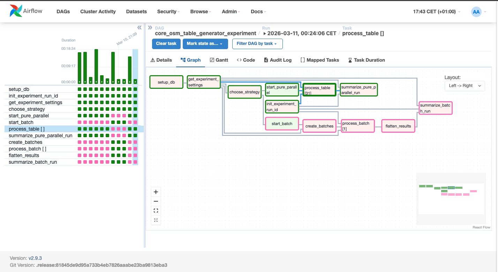

# Pipeline Architecture

## Objective

The pipeline was designed to automate the ingestion of multiple OpenStreetMap-based
Point-of-Interest (POI) layers for Berlin using a single reusable workflow.

The main architectural goal was:

- to avoid writing separate ingestion code for each layer
- to keep the system extendable through configuration
- to support scheduled refreshes of live urban data
- to maintain a consistent schema across many tables

This architecture turns a layer-by-layer manual workflow into a scalable ingestion system.

---

## High-Level Design

The final system is built around a **single dynamic Airflow DAG**.

This DAG is responsible for:

- reading table definitions from configuration files
- creating or refreshing multiple POI tables
- fetching matching features from OpenStreetMap
- applying shared transformations
- loading the results into PostgreSQL/PostGIS

The same DAG can process many layers because the actual table logic is driven by configuration,
not by hardcoded table-specific branches in the pipeline code.

---

## Core Components

### 1. Shared Schema Configuration

The DAG reads `core_columns.json` to define the common schema backbone used across all generated tables.

This includes:
- required base columns
- common reusable fields already identified across OSM layers

These columns form the stable structure of every table.

---

### 2. Layer Configuration

The DAG reads `osm_tables.json` to determine, for each layer:

- target table name
- OSM tag filters
- unique layer-specific columns

This file acts as the layer registry for the entire pipeline.

To introduce a new layer, the engineer only needs to add a new configuration entry.
The DAG picks it up on the next run without requiring changes to the pipeline code.

---

### 3. Data Reference Inputs

The architecture also relies on supporting reference files, such as:

- Berlin LOR boundaries for administrative enrichment
- optional enrichment snapshots used during earlier exploration or supporting workflows

These files are kept outside the DAG code and referenced as external inputs.

---

## DAG Execution Flow

At runtime, the DAG follows this general flow:

### Step 1 — Setup

A setup task runs once per DAG execution and prepares the database environment.

This includes:
- ensuring the target schema exists
- enabling PostGIS if required
- creating the ingestion metadata table

This creates a clean starting point for the rest of the run.

---

### Step 2 — Runtime Settings

The DAG reads runtime settings from environment variables and exposes them to downstream tasks.

These settings control:
- execution strategy
- concurrency limits
- retry behavior
- batching behavior

This allows the same DAG to operate in different modes without code changes. 

---

### Step 3 — Strategy Selection

A branch task selects the execution path based on the configured strategy.

Possible modes:

- `pure_parallel`
- `batch`

This means the same DAG supports both the fast direct mapped-table mode
and the more controlled batched mode. 

---

### Step 4 — Table Processing

The actual ingestion logic is table-oriented.

Even though the DAG supports parallel mapped execution, the processing logic itself remains
clear and sequential at the table level:

1. fetch one table definition  
2. extract matching OSM data  
3. normalize shared/core columns  
4. prepare unique columns  
5. load into the database  
6. write ingestion metadata  

This keeps the pipeline understandable while still allowing orchestration-level parallelism.

---

## One-Table Processing Logic

The architecture intentionally keeps the table-processing unit self-contained.

Each table run follows the same internal flow:

### 1. Read layer definition
The table name, tags, and unique columns are taken from the configuration.

### 2. Fetch OSM geometries
The DAG queries OSM using the configured tag filters for Berlin.

### 3. Ensure stable identifiers and geometry
Shared transformations are applied to produce a usable table structure.

### 4. Normalize shared columns
The DAG applies its transformation logic only to the shared/core part of the schema.

This includes:
- consistent identifiers
- geometry handling
- lat/lon derivation
- administrative enrichment
- stable column order

### 5. Add layer-specific columns
Unique fields from the OSM layer are appended with minimal transformation.

These fields are intentionally kept close to the raw OSM representation,
except for safe column-name normalization when required for PostgreSQL compatibility.

### 6. Replace table contents
The final dataset is written to the target table.

A metadata row is also written to the ingestion log to track the run outcome.

---

## Why Table Replacement Was Chosen

The pipeline uses a **replace-style refresh strategy** rather than row-level comparison or incremental updates.

This was a deliberate design decision.

### Reasoning

Most POI tables in this project contain only:

- a few hundred rows
- or, for a smaller number of layers, a few thousand rows

At this size, it is computationally simpler and operationally safer to:

- refresh the table contents directly
- avoid row-by-row comparison logic
- avoid merge/update complexity
- keep the load process deterministic

A full replace operation is lighter than maintaining update logic with record matching,
change detection, and conflict handling for many small- to medium-sized OSM layers.

This keeps the architecture simpler and more maintainable.

---

## Parallelism Model

The pipeline supports two orchestration styles.

### Pure Parallel Mode

In pure parallel mode:
- one mapped Airflow task is created per table
- tables run independently
- concurrency is bounded through runtime configuration

This mode favors maximum throughput. 

### Batched Mode

In batched mode:
- table definitions are grouped into batches
- each batch runs sequentially internally
- multiple batch tasks run in parallel

This mode reduces concurrency pressure on external systems and the database. The DAG implements this by creating batches from `osm_tables.json`, then mapping a `process_batch` task whose internal loop handles each table one by one. 

---

## Why the Final Public Architecture Uses Batching

Although pure parallel execution can be faster, the final public architecture is presented with **batched execution as the preferred strategy**.

The reason is architectural, not just performance-based:

- it is more controlled
- it reduces simultaneous database pressure
- it provides safer scaling behavior
- it remains configurable without changing DAG code

This makes batching the better production-style default for a multi-layer ingestion pipeline.

---

## Observability and Metadata

The architecture includes ingestion metadata logging so that each table run can be tracked.

This supports:
- monitoring pipeline behavior
- checking fetched vs inserted record counts
- diagnosing failures
- verifying successful refreshes

The experiment version of the DAG extended observability further,
but the final public DAG keeps the runtime structure simpler while preserving core ingestion logging.

---

## Why a Single DAG Was Preferred

A separate DAG per table would have increased:

- code duplication
- maintenance effort
- onboarding time for new layers
- risk of inconsistency across tables

By using one dynamic DAG instead, the architecture gains:

- consistency
- scalability
- easier maintenance
- simpler extension through configuration

This is one of the key design decisions of the project.

---

## Outcome

The final architecture provides:

- one reusable Airflow DAG
- shared schema standardization
- layer-specific flexibility through configuration
- scheduled refresh capability
- controlled execution strategy
- lightweight full-table refresh logic for moderate-sized datasets

The result is a scalable ingestion foundation for a larger location-intelligence system,
where fresh and structured POI data must be available continuously for downstream use.

