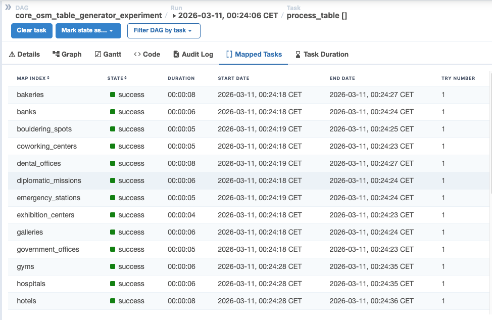
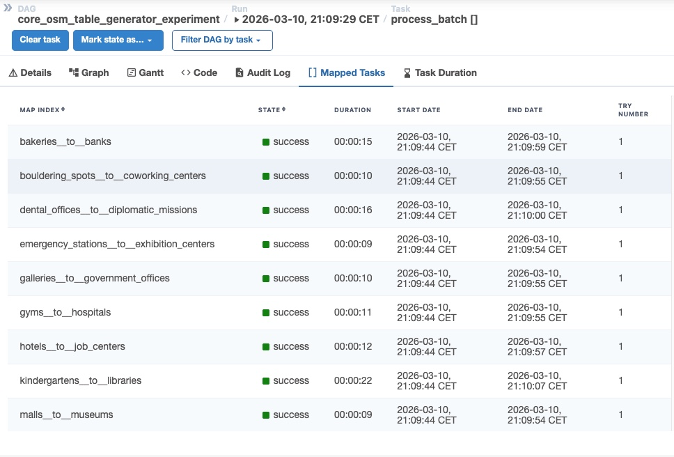

# OSM Ingestion Execution Strategy Experiment 

## Objective

This experiment evaluates execution strategies for a scalable, config-driven OSM ingestion pipeline that processes ~30+ Berlin POI layers.

The goal was to determine the best balance between:

* performance
* stability
* scalability
* operational safety

Two strategies were tested:

* Pure Parallel
* Batched Parallel

---

## System Context

### Airflow Constraints

* `core.parallelism = 32`
* `core.max_active_tasks_per_dag = 16`

👉 Effective concurrency limit: **16 tasks**

---

### Pipeline

Each table ingestion includes:

* OSM data extraction
* transformation & normalization
* spatial processing
* PostGIS insertion

---

## Strategies Tested

### Pure Parallel

* One task per table
* Fully concurrent execution

Controlled by:

* `OSM_MAX_ACTIVE_TIS_PER_DAGRUN`



---

### Batched Parallel

* Tables grouped into batches
* Sequential execution inside batch
* Parallel execution across batches

Controlled by:

* `OSM_BATCH_SIZE`
* `OSM_MAX_ACTIVE_BATCHES`



---

## Key Findings

* Pure parallel achieved fastest runtime (~59 sec)
* Batched execution was slightly slower (~74 sec)
* Airflow limits capped effective concurrency (~16)
* Unlimited parallelism caused failures and instability
* Warm runs significantly faster than cold runs

👉 Most important:

The performance gap between strategies is **relatively small**

---

## Strategy Comparison

| Metric            | Pure Parallel      | Batched                |
| ----------------- | ------------------ | ---------------------- |
| Runtime           | Faster (~59s)      | Slightly slower (~74s) |
| Stability         | Lower at high load | Higher                 |
| DB load           | Higher             | Controlled             |
| Failure isolation | Per table          | Per batch              |
| Complexity        | Lower              | Moderate               |

---

## Final Decision

### ✅ Selected Strategy: Batched Parallel

Configuration:

```
OSM_BATCH_SIZE = 2
OSM_MAX_ACTIVE_BATCHES = 8–10
```

---

## Why Batched Was Chosen

Even though pure parallel is faster:

### 1. Stability

* More predictable execution
* Fewer spikes in system load

### 2. Database Safety

* Limits concurrent connections
* Reduces overload risk

### 3. Controlled Scaling

* Fine-tuned via batch parameters

### 4. Acceptable Performance Trade-off

* ~15 sec slower, but significantly safer

---

## Alternative (Max Performance Mode)

```
OSM_STRATEGY = pure_parallel
OSM_MAX_ACTIVE_TIS_PER_DAGRUN = 16
```

Use only when:

* system is stable
* DB load is not a concern

---

## Conclusion

The experiment confirms:

* the pipeline scales effectively across 30+ tables
* execution strategy significantly impacts behavior
* stability is more important than raw speed in production

👉 Final system characteristics:

* config-driven (no code changes required)
* flexible execution strategy
* production-ready

---

## Key Takeaway

> The fastest solution is not always the best production solution.

👉 Controlled, predictable execution wins.

---
